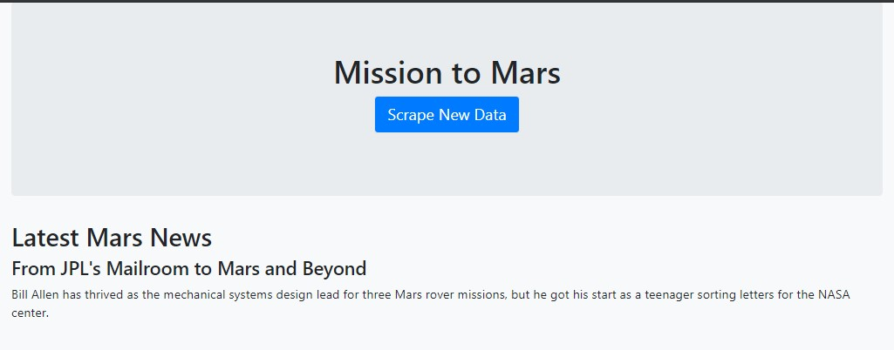
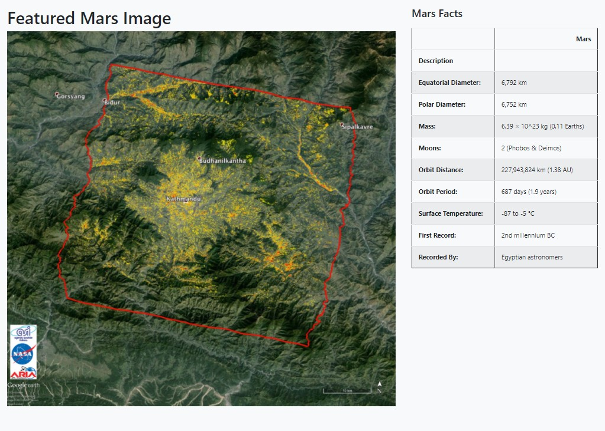
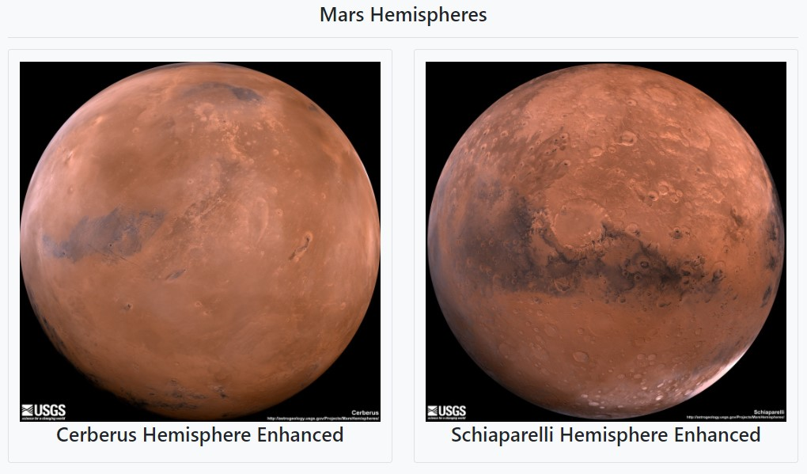
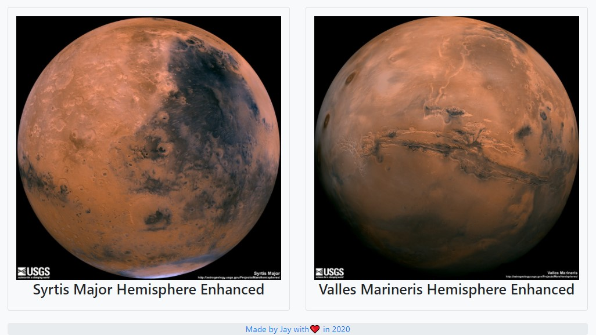

# Mission To Mars

**_Mission To Mars_** - In this exercise the purpose is to scrape the given Mars web pages to pull news, images, and information for Mars. This code demonstrates how to use the package Beautiful Soup to walk through the HTML DOM and find specific elements on each page. Then we use MongoDB to store the results of the scraping so that it later can be retrieved and displayed by a Flask application via a template.

## Files

- [mission_to_mars.ipynb](mission_to_mars.ipynb) - Jupyter Notebook that was used to experiment with the screen scraping

- [scrape_mars.py](scrape_mars.py) - Translation of the Jupyter Notebook code into a python module to be used by a Flask application to display the Mars data

- [app.py](app.py) - The main Flask app that serves two routes **/** and **/scrape**, the first route reads from MongoDB and displays the content and the second scrapes the Mars web pages and stores it into MongoDB

- [index.html](templates/index.html) - The HTML template used by Flask used to display the data

- [style.css](static/style.css) - Some basic styling for the HTML template

## Results

## Author

Made by Jay with :heart: in 2020.
